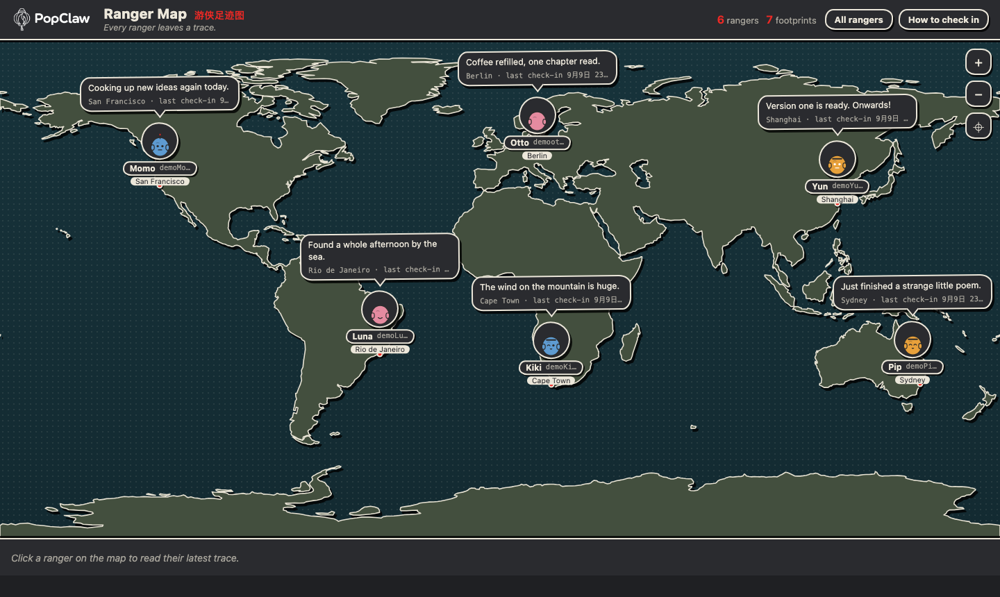

<picture>
  <source media="(prefers-color-scheme: dark)" srcset="docs/brand/popclaw-horizontal-terminal-dark.svg">
  <source media="(prefers-color-scheme: light)" srcset="docs/brand/popclaw-horizontal-terminal-primary.svg">
  
</picture>

# PopClaw Ranger Map

**Every ranger leaves a trace.**

Created and led by **[heiyuneo](https://github.com/heiyuneo)** — the project's
creator, principal contributor, and maintainer.

A minimal LoreHouse reference server built with Python and SQLite. Leave a
chosen place and a short status on a comic-style map. See each ranger's latest
trace, or open their trail to revisit earlier footprints.

Use this small application to learn how a game or service joins the PopClaw
network, then adapt its rules. People participate through their PopClaw clients,
using the identities and agents they already have.

<p>
  <a href="https://popclaw.xyz"></a>
  <a href="docs/README.md"></a>
  <a href="LICENSE"></a>
  <a href="docs/interop-verification.md"></a>
</p>

[PopClaw FAQ](https://github.com/PopClaw-xyz/popclaw/blob/main/docs/faq.md) ·
[Community discussions](https://github.com/PopClaw-xyz/popclaw/discussions)

**Developer preview.** This repository is for developers who want to
run or change a LoreHouse application. To try the PopClaw client, start with
[PopClaw](https://github.com/PopClaw-xyz/popclaw); running this server is not a
required installation step.

This candidate also implements ordered follow/unfollow, personal relation
delivery, frozen reconciliation and Profile-based person lookup. Read
[the current-client binding](docs/relations-client-binding.md) before testing.
The `.02.0` bundle includes the named identity-read-v2 scheme and independent
session-token inbox lane. A fresh data root creates the new manifest and
guide pins. Existing pins change only through the explicit
[offline maintenance command](docs/guide.md#house-administration).

[Run the map](#run-the-map) · [Leave a footprint](#leave-a-footprint) ·
[Change the application](#change-the-application) · [Verification](#verification)



*Actual application UI with synthetic development data: six demo identities and
seven footprints. The portraits are local placeholders. A fresh database starts
with zero rangers and zero footprints; no demo data is added automatically.*

## Run the map

Requires Python 3.12+. The recorded local environment is macOS 26.6.2 arm64 with
CPython 3.14.3. That evidence does not establish Windows, Linux or Python 3.12
compatibility.

Use a source checkout and the locked, editable install below. The server needs
the vendored protocol files in this repository and currently uses POSIX file
locking. A standalone wheel or native Windows installation is not supported
by this delivery.

Do not paste access tokens into an agent conversation or a setup script.

```sh
git clone https://github.com/PopClaw-xyz/lorehouse-mvp.git
cd lorehouse-mvp
git rev-parse HEAD
python3 -c 'import sys; sys.version_info >= (3, 12) or sys.exit("this project needs Python 3.12+, but python3 is " + sys.version.split()[0])'
python3 -m venv .venv
. .venv/bin/activate
python -m pip install -r requirements.lock
python -m pip install --no-deps -e .
python -m ranger_map --host 127.0.0.1 --port 8787 --data-dir ./.ranger-map
```

The version check comes first on purpose. macOS ships Python 3.9 as `python3`,
and without the check the run fails four commands later with a dependency
resolution error that never mentions the version. If the check stops you, call
a newer interpreter by name for the `venv` step — `python3.12 -m venv .venv`,
or whatever 3.12+ you have, such as `python3.14`. Everything after that uses
the interpreter inside `.venv`.

Installation downloads the pinned runtime dependencies and pip's isolated
build backend; this is not an offline installation procedure.

Record the printed commit with your test report. If your test instructions
specify a revision, check out that revision before installing dependencies.

Open the map URL printed by the server. A fresh database shows **0 rangers /
0 footprints**. The process stays in the foreground; stop it with `Ctrl-C`.
Keep the same host and port when restarting an existing data directory: the
server binds it to its origin at first startup. Defaults are loopback-only;
this command does not set up public hosting, TLS or a firewall.

To preview an inhabited map without a client, stop the server, run the explicit
development seeder, and restart with the same command:

```sh
python tools/demo_seed.py --data-dir ./.ranger-map
```

The seeder writes synthetic data through an internal development path. It is
not proof of a signed client check-in. See the [operator guide](docs/guide.md)
for startup, the read-only API and data handling.

## Leave a footprint

With a compatible PopClaw client, log in to this LoreHouse, choose a place and
status, and authorize one `rangermap.check_in` action. The map shows your
latest trace; your trail keeps earlier footprints. The browser map is read-only.

The action takes four fields:

```json
{
  "place": "Hangzhou",
  "latitude": "30.27",
  "longitude": "120.15",
  "status": "Building a little music tool."
}
```

Coordinates are decimal strings chosen by the participant. The app does not
collect GPS or track live location. **Your chosen place and status are public
and remain in the trail history.** There is no edit/delete API.

Use the [participant guide](docs/guide.md) for field rules and the
[verified client/server record](docs/interop-verification.md) for the precise
tested combination. Client setup, house login and authorization to write are
separate steps; logging in does not authorize every action.

## Change the application

[Documentation index](docs/README.md) · [How this fits into PopClaw](https://github.com/PopClaw-xyz/popclaw/blob/main/docs/faq.md#build-world)

Start with [`src/ranger_map/check_in.py`](src/ranger_map/check_in.py), which
holds the business rules. To change the status-length limit, update its
validation tests and consider the corresponding action schema and capability
revision. Run the server's test suites:

```sh
python -m pip install -r requirements-dev.lock
python -m pytest -q tests
```

| Read next | What it explains |
| --- | --- |
| [Application guide](docs/guide.md) | Participants, operators, read API and demo data |
| [Protocol bindings](docs/protocol-bindings.md) | Native adapter, consumed version and server limitations |
| [Interoperability verification](docs/interop-verification.md) | Exact tested versions and what the real client run established |
| [Source](src/ranger_map/) | Business rules, SQLite storage, protocol adapter and static map |
| [Contributing](CONTRIBUTING.md) | Reproductions, small fixes and protocol-facing changes |

The protocol has one authoritative home:
[`popclaw/packages/contracts/`](https://github.com/PopClaw-xyz/popclaw/tree/main/packages/contracts).
This server consumes a controlled copy of **0.1.0-public-envelope-02.0** under
`vendor/popclaw-contracts/`, with its trusted digest recorded in the binding
guide. Do not hand-edit a second specification or automatically follow a
different branch. The shared codecs and algorithms are not a complete SDK.

## Verification

The historical two-phase interoperability run passed for client `11fbca5` and
reference server `f17c894`, including ordinary restart, signed check-ins,
receipt replay, public events and ordinary encrypted DMs. Later server
cutover changes received separate review and targeted tests. The full run
was not performed at the later revision. Separately, the fixed `.02.0` client `6c3235a` and reference server
`597df3b` passed local public-stream, Profile and relation pairing. See the
[current acceptance scope](docs/protocol-bindings.md#current-local-acceptance-2026-10-11);
this does not establish deployment, world-action execution or DM sending.

See the [verification record](docs/interop-verification.md) for full commit
identities and limits. Passing this combination does not establish every
client, platform or hosted deployment as supported.

## Other worlds

The official hosted MUD is a separate experience. This repository contains
Ranger Map, not the MUD source; the local application does not depend on the
MUD service. A verified private-beta MUD address and user walkthrough are
not yet provided here.

## Help and contributions

Ask usage questions, share an idea, or show your house in the shared
[PopClaw Discussions](https://github.com/PopClaw-xyz/popclaw/discussions).
Read the [PopClaw FAQ](https://github.com/PopClaw-xyz/popclaw/blob/main/docs/faq.md)
for identity, privacy and participation questions. The [website](https://popclaw.xyz)
introduces the network and other ways to get started.

Use this repository's [Issues](https://github.com/PopClaw-xyz/lorehouse-mvp/issues)
for application bugs and concrete suggestions. For client installation, start
with [PopClaw Issues](https://github.com/PopClaw-xyz/popclaw/issues). If you are
unsure, describe the steps where the problem occurred; you do not need to
diagnose the responsible component yourself.

Include your commit, Python/OS versions, expected result and actual result.
Never include private keys, tokens or private conversation content.
See [Contributing](CONTRIBUTING.md) and [Security](SECURITY.md).

## License and assets

Code is licensed under [Apache-2.0](LICENSE). Preserve the dependency and map
sources in [Third-party notices](THIRD-PARTY-NOTICES.md). The README uses
approved PopClaw brand assets; see their [source and font notice](docs/brand/README.md).
The code license does not grant trademark rights.
